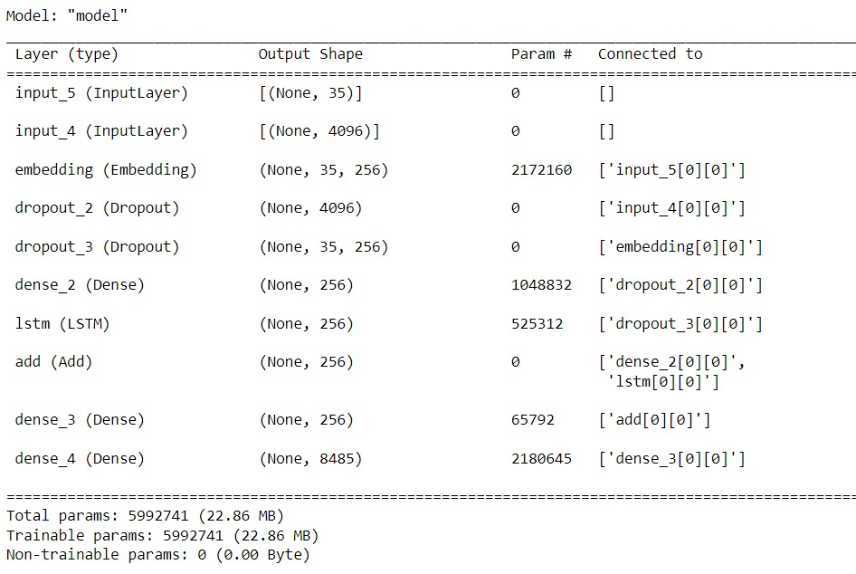
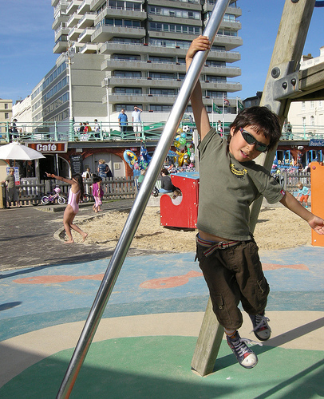
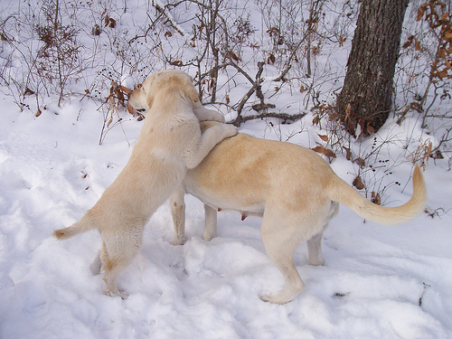
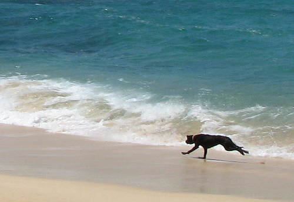
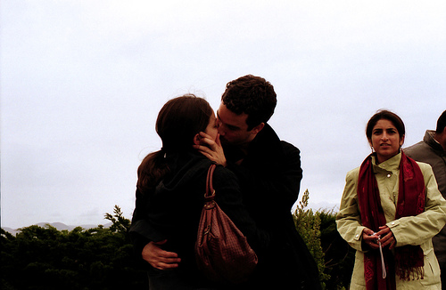
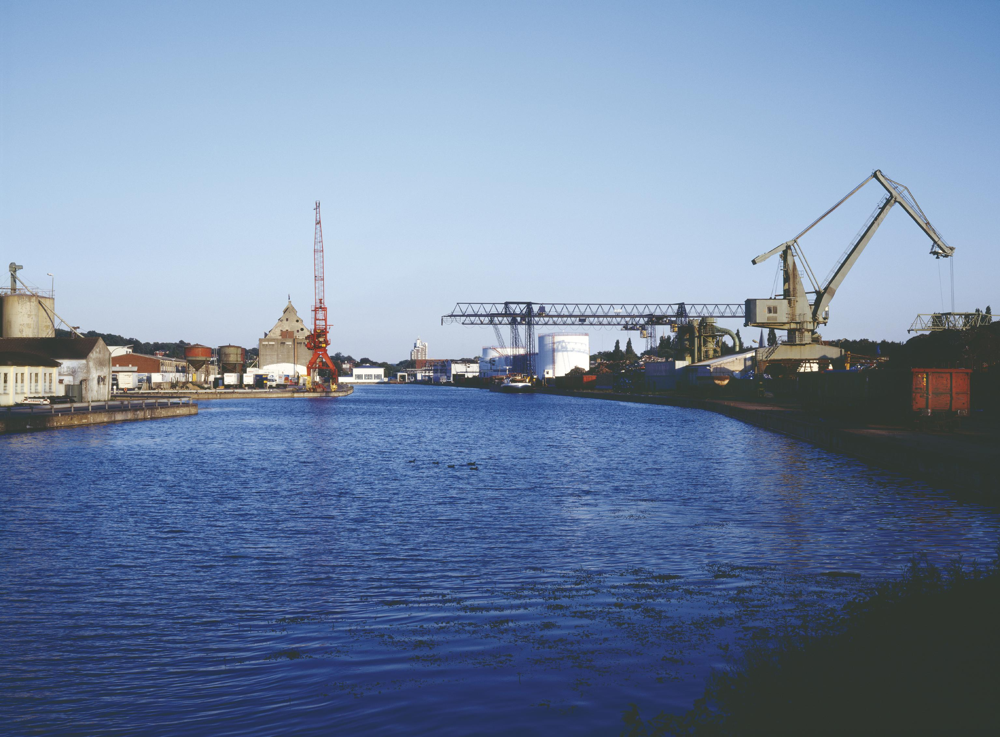

<h1 align="center"> IMAGE CAPTION GENERATOR </h1>

  
<h3> Table of contents </h3>
<ol>
    <li><a href="#intro">Introduction</a></li>
    <li><a href="#data">Dataset</a></li>
    <li><a href="#preprocessing">Data preprocessing</a></li>
    <li><a href="#models">Deep Learning model</a></li>
    <li><a href="#results">Results and interpretation</a> </li>
    <li><a href="#acknowledgement">Acknowledgement</a></li>
</ol>

<h2 id="intro">Introduction</h2>

Given an image, we would like to find out what its content is,  what it is about. Specifically, a caption will be generated in order to precisely describe the correspondng image. The topic therefore deals with an intersection of Computer Vision and Natural Language Processing, which has been an interesting topic and has got a lot of attention recently.

In this project I will be using the pre-trained model VGG16. VGG stands for Visual Geometry Group, a research group at the University of Oxford.

  

 

<h2 id="data">Dataset</h2>

The dataset used in this project is Flickr8k, which can be downloaded via the <a href="https://www.kaggle.com/code/dbdmobile/image-captioner/input"> link </a>. It contains a folder Images with 8091 pictures and a file captions.txt, each caption has 5 descriptions for an image.

<h2 id="preprocessing">Data preprocessing</h2>
A careful data preparation has been carried out, among them
<ul>
    <li> image data: the image features are extracted by using VGG16 </li>
    <li> text data: convert all words to lowercase, remove all punctuation marks, remove all words that are one character or less long, remove all words with numbers in them </li>
 
</ul>

<h2 id="models">Deep Learning model</h2>

  

 

</ul>

 <h2 id="results">Results and interpretation</h2>

Image | Caption 
--- | --- 
 | **Generated Caption:** The boy is swinging on the playground.
 | **Generated Caption:** Two dogs are playing in the snow.
 | **Generated Caption:** dog running on the beach.
 | **Generated Caption:** two young adults stand on the street.
 | **Generated Caption:** Man is being pulled off the dock at the end of boat.

<h2 id="acknowledgement">Acknowledgement</h2>
This project is inspired by the works of 
<ul>
    <li> <a href="https://www.youtube.com/watch?v=Nt7WJa2iu0s&list=PLQ22X3eLL96fi00hQL2VNaX-OKuDZ3H7s&index=11"> Vikas Paruchuri</a> </li>
    <li> <a href="https://www.youtube.com/watch?v=Nt7WJa2iu0s&list=PLQ22X3eLL96fi00hQL2VNaX-OKuDZ3H7s&index=11"> Vikas Paruchuri</a> </li>
    <li> <a href="https://www.youtube.com/watch?v=Nt7WJa2iu0s&list=PLQ22X3eLL96fi00hQL2VNaX-OKuDZ3H7s&index=11"> Vikas Paruchuri</a> </li>
  
</ul>
